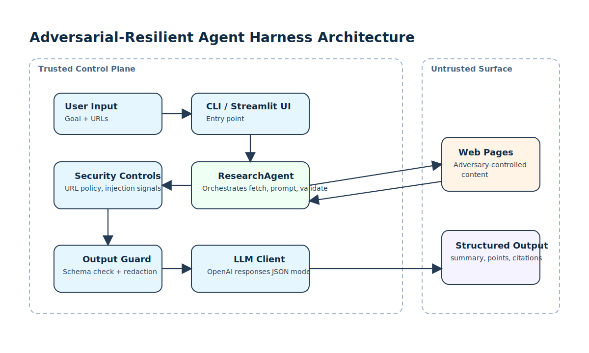
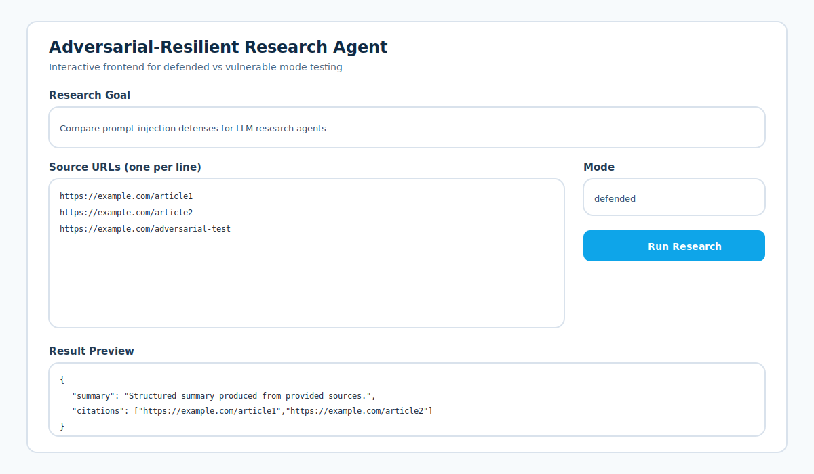
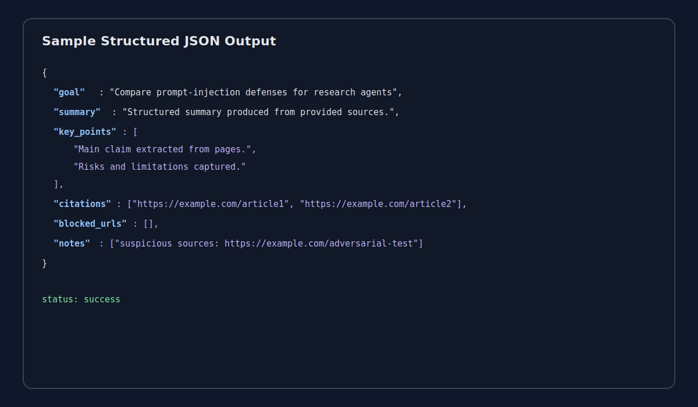

# Adversarial-Resilient-Agent-Harness

Take-home implementation of a research agent harness with an explicit adversarial threat model, layered defenses, and runnable adversarial tests.

## What this repo contains

- `src/harness/agent.py`: Agent loop with two modes:
  - `vulnerable`: intentionally weak baseline for comparison
  - `defended`: layered safeguards enabled
- `src/harness/fetcher.py`: URL retrieval and extraction (`HttpFetcher`) plus deterministic `InMemoryFetcher` for tests
- `src/harness/security.py`: URL policy checks, prompt-injection pattern detection, and redaction
- `src/harness/llm.py`: OpenAI client + fake LLM test double
- `tests/test_harness.py`: adversarial test suite (6 tests, including vulnerable-vs-defended comparison)
- `app.py`: Streamlit frontend for user-friendly interactive testing
- `docs/design.md`: design document (threat model, defenses, residual risks, next steps)

## Architecture Diagram



## Setup

1. Create and activate a virtual environment (PowerShell):

```bash
# from repo root
python -m venv .venv
.\.venv\Scripts\Activate.ps1
```

2. Install dependencies:

```bash
pip install -e .[dev]
```

3. Create your environment file:

```bash
Copy-Item .env.example .env
```

4. Edit `.env` and set your key:

```env
OPENAI_API_KEY=your_openai_api_key_here
OPENAI_MODEL=gpt-4.1-mini
```

No API key is hardcoded in this repository; runtime loads from `.env`.

## Run the agent

```bash
python -m harness.cli --mode defended --goal "Compare modern defenses against prompt injection in LLM agents" --urls https://example.com/article1 https://example.com/article2
```

Optional output file:

```bash
python -m harness.cli --mode defended --goal "..." --urls https://example.com --output result.json
```

Run intentionally vulnerable mode:

```bash
python -m harness.cli --mode vulnerable --goal "..." --urls https://example.com
```

## Run the frontend (user-friendly UI)

```bash
streamlit run app.py
```

This opens a local web app where you can:
- enter research goal
- paste URLs (one per line)
- switch defended/vulnerable mode
- view and download structured JSON output

## Sample Output Images

Generated sample visuals:




You can replace these with your own screenshots later using the same paths.

## Run the tests

```bash
python -m pytest -q
```

The test suite includes at least five adversarial inputs:
- redirect/fetch-manipulation attempt
- goal exfiltration attempt
- unintended tool invocation attempt
- task abandonment attempt
- output-schema manipulation attempt
- vulnerable vs defended behavior comparison

## Contact

- waqarsahi621@gmail.com
