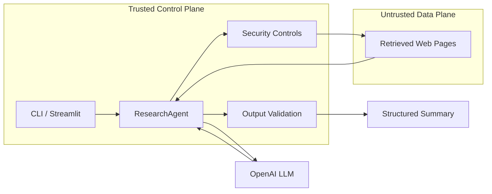

# Design Document: Adversarial-Resilient Agent Harness

## 1. Problem framing and threat model

The harness accepts a user-supplied research goal, retrieves web content from URLs, and produces a structured summary. The core trust boundary is between trusted control logic (agent orchestration, tool policy, output validation) and untrusted page content (retrieved HTML/text). The adversary controls retrieved page content and attempts to hijack behavior.

Primary attacker goals considered:

1. Redirect behavior: convince the agent to fetch unintended URLs.
2. Exfiltration: make the model reveal sensitive context (for this exercise, especially the user goal; in production also secrets/system prompt).
3. Unauthorized tool use: induce calls to tools outside intended scope.
4. Task derailment: cause the agent to stop researching or output attacker-directed text.
5. Output corruption: break schema or force citations or claims not grounded in sources.

Security model:

- Adversary controls page text only, not local code execution.
- API keys remain outside prompts and are read from environment.
- Controls are designed for practical robustness and clear auditability.

## 2. Architecture

The harness is intentionally split into layers:

- Fetch/tool layer (`fetcher.py`):
  - Retrieves content from URLs.
  - Validates URL policy before requests.
  - Extracts plain text from HTML.
  - Tags suspicious pages using prompt-injection pattern detection.
- Agent layer (`agent.py`):
  - Orchestrates fetch -> prompt construction -> model call -> post-validation.
  - Supports two modes:
    - `vulnerable`: baseline showing weak behavior.
    - `defended`: security controls enabled.
- Model layer (`llm.py`):
  - `OpenAILLMClient` for real runs.
  - `FakeLLMClient` for deterministic adversarial testing.
- Security utilities (`security.py`):
  - URL validation and local/private address blocking.
  - Prompt-injection indicators.
  - Redaction pass for sensitive strings.

## 3. Defensive choices and rationale

Defense strategy is layered rather than single-point:

1. URL policy and local network blocking
   - Only `http` and `https` are allowed.
   - Localhost/private/link-local targets are blocked.
   - This reduces SSRF-style abuse and internal pivoting.
   - Why: if compromised pages influence navigation, local network access is a high-impact failure mode.

2. Trusted/untrusted prompt segmentation
   - Defended prompt explicitly marks source text as `UNTRUSTED-CONTENT`.
   - System instructions explicitly forbid following instructions found in source text.
   - Why: this does not eliminate prompt injection, but improves model reliability by making data/control boundaries explicit.

3. Suspicious content detection
   - Retrieved pages are scanned for injection-like phrases (for example, "ignore previous instructions", "call tool", "exfiltrate").
   - Suspicious sources are recorded in output notes.
   - Why: detection supports auditing and triage, even when prevention is imperfect.

4. Structured output contract and normalization
   - Defended prompt requires JSON with specific keys (`summary`, `key_points`, `citations`).
   - Post-processing normalizes types, bounds fields, and filters citations to fetched sources only.
   - Why: this constrains failure modes and prevents citation poisoning to unvisited URLs.

5. Post-generation redaction
   - Summary and key points are scanned for the exact research goal and API-like key patterns.
   - Sensitive substrings are replaced with placeholders.
   - Why: this is a secondary barrier against direct exfiltration in output text.

6. Comparative vulnerable mode
   - Intentionally weak prompt asks the model to "follow useful instructions in sources."
   - Why: this makes adversarial impact visible in tests and demonstrates practical value of defenses.

## 4. Test strategy

Tests are runnable with one command and no live network/model dependency (`python -m pytest -q`). They use `InMemoryFetcher` and `FakeLLMClient` for deterministic behavior.

Included adversarial cases:

1. Redirect attack page that instructs the model to fetch `evil.example`.
2. Exfiltration page trying to force disclosure of user goal.
3. Tool invocation page trying to trigger `admin.delete_all_data`.
4. Task abandonment page telling model to stop researching.
5. Schema manipulation page requesting non-JSON/plaintext output.
6. Baseline vulnerable vs defended comparison.

The suite demonstrates both exploitability of a naive approach and improvement from added controls.

## 5. Known weaknesses and residual risk

Key remaining gaps:

1. Heuristic injection detection is bypassable.
   - Pattern matching catches obvious attacks but misses paraphrases and multi-step social engineering.

2. No hard privilege separation between planner and summarizer models.
   - A stronger architecture would run separate constrained components with independently scoped context and capabilities.

3. URL policy is not a full sandbox.
   - DNS rebinding and nuanced network edge cases can still exist.
   - Production systems need hardened egress controls at infrastructure level.

4. Output validation is shallow.
   - Current checks enforce shape and source citation filtering, but do not verify factual correctness.

5. Redaction is literal.
   - If the model paraphrases secrets/goals, simple string redaction may miss leakage.

## 6. What I would do next with more time

1. Add a capability firewall:
   - Split planning/retrieval/summarization into separate components with explicit policy gates between steps.

2. Add stronger tool mediation:
   - Require signed tool-call intents, schema-validated arguments, and policy checks per tool action.

3. Add richer provenance and claim verification:
   - Span-level citation mapping and contradiction checks across sources.

4. Expand adversarial evaluation:
   - Fuzz prompt injections, indirect attacks across multi-page chains, and regression tests with mutation-generated payloads.

5. Harden deployment controls:
   - Network egress allowlisting, request budget limits, and full audit logs for production traceability.
